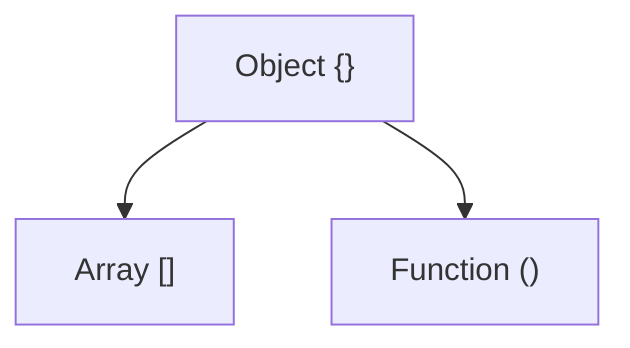

# The Javascript Engine
- JIT compilation
	- Code is first interpreted
	- *Profiler* watches code and figures out ways it can be optimized
	- If some lines of code are run more than once it passes that code onto the *compiler*
	- Replaced bytecode with machine code
	- *Knowing all this helps us write more optimized code, and avoid confusing the compiler*

## Optimization
- Things to avoid
	- `eval()`
	- arguments (use destructuring instead)
	- for in (use `Object.keys()` instead)
	- with
	- delete
- Inline caching
	- Code that executes the same function repeatedly uses this
	- Instead of looking up parameters and running the method again it just replaces the method with the value the method returns
- Hidden Classes
	- `delete` really effects this
	- To avoid deoptimization, assign all properties in a constructor and setting variables in the same order

## WebAssembly
- Standard binary executable for browsers

## Memory Leaks
- Common causes
	- Too many global variables or overly large global variables
	- Adding event listeners but never removing them
	- `setInterval()` - referencing objects in here but NEVER clear the interval will stop those referenced objects from ever being cleaned up

## Single Threaded
- Has only one callstack
- No running functions in parallel
- JS is synchronous

# Javascript Runtime
- Web API comes with the browser in its Javascript Runtime
	- `fetch`
	- `setInterval()`
	- Implemented by C++ or something similar in the Browser
	- *Asynchronous*
- Call Stack will call out to Web API for things like `setTimeout()` and the Web API will handle it in a separate thread/background
- Response from Web API will add an event to the Event Loop which notifies the Call Stack *once it's free* that there's something in the Callback Queue, and *when it's available will add it to the Call Stack*

```
Call Stack -> Web API -> Event Loop + Callback Queue -> Call Stack
```

## Cool Example
```javascript
console.log(1)
setTimeout(() => console.log(2), 0)
console.log(3)

// will output:
// 1
// 3
// 2

// This execution will happen in this order NO MATTER WHAT time we set in setInterval() because setInterval() is part of the Web API and will only ever be ran AFTER the Call Stack is empty, which won't occur until the Javascript file is completely ran and done!
```

# NodeJs
- Javascript *runtime*
![[Pasted image 20230808094638.png]]
- Doesn't have `window` but does have `global`, which includes stuff like
	- `setInterval()`
- Offers a new type of server model for handling requests
![[Pasted image 20230808094958.png|400]]
	- PHP
		- Used to create a thread for each request
		- Thread pool (however many reqs the server can accept) can max out
	- NodeJS
		- Any req comes in and gets tossed onto it's async runtime
		- Can handle as many requests as you want

# Terms and Special Methods
## Terms
`Execution Context` - when the code sees a set of brackets it'll create an execution context, and adds it to the stack.  You have things like `this` and all variables, methods, etc, available in a specific context.

`Lexical Environment` - where something is written/defined.  Can be accessed via `[[scope]]`

`Lexical Scope / Static Scope` - available data + vars where func was defined determines our available vars.  Not where the function is called (`Dynamic Scope`)

`Hoisting` -  JS engine allocating memory for variables and funcs in creation phase before it executes it (lets you run the `sing()` method before it's actually been defined in the file, like right before the function is defined).  Variables are undefined initially (partially hoisted), but functions actually get defined (fully hoisted).  The first thing the engine has to see is `var` or `function` it'll hoist(NO OTHER TERMS), but if you wrap methods in parenthesis or use something like `const` it won't get hoisted.  *This occurs every time we create a function too!*  **Avoid hoisting if we can, by not using `var`, and instead use `const` and `let`.**

`Function Expression` - `const thing = function() {}` - defined at runtime

`Function Declaration` - `function blah() {}` - defined at parse time

`arguments` - reserved variable present in all function execution contexts, and is an index based object that points to each of the arguments passed in. (ex: `marry('bob', 'sally')` would have the following `arguments` value `{0: 'bob', 1: 'sally'}`).  This is dangerous to use, was initially used, but really shouldn't be used anymore (according to the author).  Meh, this seems fine to use if it's useful and you're careful.

`Variable Environment` - where variables live in the execution context

`Scope Chain` links us to variables and things inside the parent environment

`'use strict'` was added to stop JS from trying to do weird tricks/pitfalls

`function scope` - scope inside something between brackets, like inside an `if` statement.  If you use `var` the variable defined there will be available outside of the block.  Other languages use `block scope` that wouldn't allow this variable to be accessed globally.  If you use the `let` or `const` keyword tho it'll cause `block scope` to be used.

`this` - can unexpectedly refer to the `Window` object in the browser, even inside a function, which can be odd.  This can go away with the `use strict` flag.  `this` == "who called me"?  Isn't lexically scoped, is actually dynamically scoped: *it only matters who called it*

`use strict` - Disables funky weird JS behavior.  ES6 modules use this by default.

`arrow functions` - lexically scoped

`scope` is a function based thing, `context` is more about objects (ex: what's the value of the `this` var?).  `context` relates to how and who calls a function, while `scope` relates to the visibility of the variables.

`let` - lets you use block scoping

## call()
`a()` is the same as `a.call()`, all functions have `call()` implicitly added... However, `call()` calls a method of an object, substituting another object for the current object.

## apply()
Same as `call()`,  except that `apply()` takes an array of parameters rather than individual parameters

```
// call()
obj.stuff.call(anotherObj, 1, 2, 3, 4)

// apply()
obj.stuff.call(anotherObj, [1, 2, 3, 4])
```

## bind()
Returns a new function with a certain context and parameters.  Usually used when we want a certain function to be called later on with a specific context.  Lets us specify the context and parameters to pass to the function ahead of time, and we can call the function later.  Nifty!

### bind() and currying
`bind()` lets you bind to a method without specifying all parameters, thus we can easily curry a method!

# Types
- Primitive - *single values in memory*, *have object wrappers* (primitives act as you'd expect, but have functions attached to them like an object), and *immutable*
	- Numbers
	- Boolean
	- String
	- Undefined
		- Absence of definition
	- Null (type == object - is a mistake the creator admitted)
		- There's no value there.  Absence of value.
	- Symbol('just me') (ES6)
		- Used for obj properties to ensure the property is unique
		- Won't use much
- Non-Primitive - *doesn't contain actual value directly*
	- Objects {} (which is also an array and function)

`typeof` - tells us the type of a variable


*Arrays and functions are objects*

`typeof function == 'function'`, but underneath the hood it's an object

## Arrays
These two are effectively equivalent
```
[1,2,3]

{
	0: 1,
	1: 2,
	2: 3
}
```

`Array.isArray()` tells us if an array/object is an array

## Deep Clone
`JSON.parse(JSON.stringify(obj))` - deep clone that works, but can be CPU intensive, should probably clone a different way

## Type Coercion
The language converting a type to another type

JS has a heavy hand in this because it's dynamically typed, and JS tries to help you (sometimes to a fault)

`==` - compare with type coercion (don't use this, it's confusing)
`===` - compare without coercion

## Dynamic vs. Static Typing
`let name = 'kevin'` vs `String name = "kevin"`
- Dynamic
	- Spend less time describing types, saves dev time
	- More flexible
	- "Sure it can have more runtime errors, but you should have written more tests!"
- Static
	- More time writing/describing types, but you have less type errors!
	- Less flexible
	- "Will have less runtime errors, but could make you overconfident and write less tests"
	- Self documenting code (can see types being used)
	- Easier for new people to understand your code

## Static Typing In JS
- Multiple tools you can use for this
	- Flow (created by FB)
		- Translated via Babel
		- Produces JS
		- Static type checker
		- Add `//@flow` to top of files to have it know whether or not to check files
	- Elm
		- Translated via Elm
		- Produces JS
		- Own compiler
		- Same as ReasonML
	- ReasonML (created by FB) (based on a language called Okamel?)
		- Translated via ReasonML
		- Produces JS
		- Own compiler
		- Diff between Reason and TS - Reason is a totally separate language from JS
		- Doesn't depend on any JS changes being made
	- Typescript (Microsoft)
		- Translated via TS
		- Produces JS
		- Differs from Flow because it has its own compiler (Flow uses Babel)
		- Superset of JS (add functionality on top of JS)
		- *Growth outweighs growth of all the other tools*
		- Angular uses this
		- React is also starting to use this, and most of the JS community
		- Even more loved than JS according to StackOverflow
## Weakly vs Strongly Typed
JS is `dynamic` and `weakly` typed
```js
let a = 'hello'
a + 17 // hello17 (type coersion) (can't do this in a strongly typed language like Python...)
```

```python
a = 'hello'
a + 17 # this would error
```

# The Two Pillars (Closures and Prototypal Inheritance)
Presenter thinks `Closures` and `Prototypes` give you superpowers in JS

## Functions are objects
JS under the hood creates a "callable object"

```js
function blah() {
	console.log('hey')
}

// is effectively the same as the following (tho this code won't work)

// 'callable object' that gives it some bonus props and methods, plus can be called via ()
blah = {
	name: 'blah', // doesn't exist for anon functions
	(): console.log('hey'),
	call(),
	apply(),
	bind()
}
```

`new Function()` - function constructor, where you pass the function text into the constructor, and you can tell it the parameter names as well

`First Class Citizens`
1. Functions can be assigned to vars and properties of objects
2. Pass functions as arguments to another function
3. Can return functions as a value from other functions

`Higher Order Functions` - Function that can take an argument as an arg, or returns a function

### Things to watch out for
- Init functions in loops
- Good to set default params on a function to avoid edge cases
## Closures
We get these because `functions` are first class citizens and `lexical scope`

Example:
```js
function a() {
	const grandpa = 'grandpa'
	return function b() {
		const father = 'father'
		return function c() {
			const son = 'son'
			console.log(`${grandpa} > ${father} > ${son}`)
		}
	}
}

const one = a()

// the fact that the b() function has access to the 'grandpa' variable even tho a() is off the stack (and its variables), THAT is a closure, the extended scope that something preserves.

// grandpa goes up into the 'closure box', aka the heap, and the gc won't clean it up because it's inside a closure (and is still referenced)

// c() will look inside the closure box to find the variables it's looking for
```

- Closures are a feature of JS
- **IMPORTANT** Use `lexical scoping / statically scoped`
- Even Web API calls still can access closure data

Weird Scenario
```js
function doStuff() {
	setTimeout(function() {
		console.log(stuff)
	}, 4000)
	const stuff = 'hey'
}

doStuff() // will print 'hey' after 4 seconds, because the closure still keeps that var because it sees that it's referenced, and the Web API calls out for it
```

### Main Benefits of Closures
1. Memory efficient

```js
function bigDatabaseOperation() {
	const data = [1,2,3] // pretend this is some super heavy db call
	return function(index) {
		return data[index]
	}
}

const bigData = bigDatabaseOperation()
bigData(2) // can use this instead of hitting the database each time
// this also avoids storing the data somewhere in a storage object or polluting the global scope
```

2. Encapsulation
You can store data inside of a function/object and it can maintain state + have functions you can expose to interact with that data.

```js
function basicallyAClass() {
	let value = 0
	// return public methods and data (expose only what you want)
	return {
		inc: () => value++,
		getVal: () => value,
		reset: () => value = 0
	}
}

const counter = basicallyAClass()

counter.inc()
console.log(counter.getVal()) // 1
counter.inc()
counter.inc()
console.log(counter.getVal()) // 3
counter.reset()
console.log(counter.getVal()) // 0
```

## Prototypes
JS uses *prototypal inheritance* for creating objects

Use the `__proto__` property of the object to look up the chain of objects.

```
object (instance) __proto__
-->
object type __proto__
-->
parent object type __proto__
```

Applying a prototype to an object

```js
const animal = {
	age: 1,
	breathe() => console.log('whew!')
}

const dog = {
	bark() => console.log('woof!'),
	breathe() => console.log('pant!')
}

// this makes the dog 'extend' animal, tho the properties in 'dog' won't get overwritten (like breath())
dog.__proto__ = animal
dog.age // 1
dog.breathe() // pant!
```

This is basically just inheritance, except that the base "objects" are prototype objects

Saves memory if you have lots of the same object, since the methods all share the same method in memory.

Don't use `__proto__` though, it's bad for performance and there's better ways to inherit (in OO section of course)

Only `functions` have the `prototype` and `__proto__` attributes (except the base `Object`, that has it too - since it's a type of `Function`), and are *always* a function
- don't really use the `prototype` on the actual object, but really only use them when using constructor `Functions`

`__proto__` points toward the `prototype` object on the type we inherited from.  The current function will also have its own `prototype` object

`Object` is a `Function`, `Object` is a constructor that creates the object wrapper

`Object` can be used to create `{}` (`Object.prototype`), which `Object` updates with all the variables and whatnot that it needs
- When you create one of these objects it creates it from the `prototype`

Prototypes avoid us repeating ourselves (duplicating functions in memory)

## Scheme + Java
JS was inspired by these two languages

`Scheme` - created at MIT in the 70s, one of the first languages to have closures
- functional
- had functions as first class citizens
`Java` - was trendiest at the time
- classes were important and OO

# Object Oriented Programming
Programming Paradigm - make code easier to reason about
Bringing data and its behavior in a single location (object) makes it easier to understand
Like building a robot (a head, arm, legs, etc and you build all that together)
*Prototypes*

Data == State
Methods == Actions (manipulate state)

Paradigms
- more clear and understandable
- easy to extend (easier for more devs and as program expands)
- easy to maintain
- memory effecient
- DRY (do not repeat yourself)

Lets us make complex code more organized

Two main things in programming
- data
- behavior

## Factory Functions

Example
```js
function createCar(name, manu) {
	return {
		name,
		manu,
		drive: () => console.log('vroooooom')
	}
}

const ferrari = createCar('fastcar', 'ferrari')
const mustang = createCar('mustang', 'ford')
```


*Shortcoming*: you'd have to create the `drive()` function for each car, that's lot of extra memory with no benefit.  Solution: *prototypal inheritance*, but we have other solutions we can use too:

```js
const carFunctions = {
	drive: () => console.log('vroooooom')
}

function createCar(name, manu) {
	return {
		name,
		manu
	}
}

const ferrari = createCar('fastcar', 'ferrari')
ferrari.drive = carFunctions.drive
const mustang = createCar('mustang', 'ford')
mustang.drive = carFunctions.drive
```

That's a lot of work though, and and lot of extra code.  Instead we can use...
`Object.create()`
- Creates a *link* between what's passed in and the new attributes you attached to the generated object.  This uses prototypal inheritance for us (creates the `__proto__` chain for us)

```js
const carFunctions = {
	drive: () => console.log('vroooooom')
}

function createCar(name, manu) {
	const car = Object.create(carFunctions)
	car.name = name
	car.manu = manu
	return car
}

const ferrari = createCar('fastcar', 'ferrari')
const mustang = createCar('mustang', 'ford')
```

This is true prototypal inheritance, however you won't see devs doing this (it's kinda non-standard for the community).

## Constructor Functions

What was available in the beginning before `Object.create()`: *Constructor functions*, and using `new`, which changes how `this` works in the created object, and returns the newly created object!  Because we're using a `function` here, it means our obj will get the `prototype` property.  Normally this is useless with regular functions, but with *constructor functions* we can finally use that `prototype` to add functions to the obj!

Also worth noting that the `prototype` that's created by the `new` keyword will contain all the stuff in the constructor function.


```js
function Car(name, manu) { // note the use of a capital letter, that tells you to use 'new'
	this.name = name
	this.manu = manu
}
Car.prototype.drive = function() { console.log(`${this.name} goes vrooooom`) } // single location in memory
const mustang = new Car('mustang', 'ford') // constructor function
```

**NOTE: arrow functions are lexically scoped, but `function` is dynamically scoped**

A lot of people don't like the `new` keyword though lol

Using the native contructor function:

```js
const Car = new Function('name', 'manu', `this.name = name; this.manu = manu`)
const mustang = new Car('mustang', 'ford')
```

`__proto__` and `prototype` of Constructor objects

```js
function Dude() {}
const dude = new Dude()
dude.__proto__ // Dude prototype
dude.prototype // undefined, because see next line, and only functions have access to the prototype object
console.log(typeof dude) // object
```

A quick *gotcha*...

```js
function Dude() {}
Dude.prototype.build = function() {
	console.log(this) // this == dude obj
	function building() {
		console.log(this) // this == Window, can avoid bad this by grabbing this from outside the function
	}
	building()
}
```

This gotcha occurs because it's a function inside of functions/methods, so it gets the `window`

*ES6* introduced `classes`, but they are just syntactic sugar, we're still using prototypes.  It wasn't given classes originally because Brendan was told not to make it too much like Java.  Fark.

JS has the `instanceof` keyword!

## this - 4 ways
1. `new` and the constructor function (refers to the object you're creating)
2. implicit binding - when creating an `{}` you can use `this` which will refer to the object you're creating
3. explicit binding - calling the `bind()` function on the function to specify exactly which `this` you want it to refer to
4. arrow functions - `this` is lexically scoped, as opposed to dynamic scoping like everything else

## Inheritance

```js
class Mustang extends Car {}
```

Still uses prototypal inheritance behind the scenes, we still have the `__proto__` chain!  This uses efficient linking to only define our classes and methods.

## 4 Pillars of OOP
1. *Encapsulation* - containing data and functions relevant to their objects.  wrapping code that's related
2. *Abstraction* - hiding the complexity from the user, creating simpler interfaces
3. *Inheritance*
4. *Polymorphism* - call a method with different classes and getting diff behavior depending on the class/type
# Functional Programming
Data and behavior are distinctive things and should be kept apart for clarity
Give me data and functions, and I'll return something from that processed data (pipe)
*All about separation of concerns*
*Separate data and functions*
*Emphasis on simplicity with data and functions*
*Closures*

Originates from Lambda Calculus - Math

Work really well with distributed computing and parallelization

Has a lot of restraints
## 1 Pillar
- Pure Functions
	- All objects are immutable, objects cannot be changed

## Exercise: Amazon
## First Attempt
```js
const user = {
    name: 'Kim',
    active: true,
    cart: [],
    purchases: []
}

const item = {
    name: 'donut',
    cost: 1.00
}

function addItemToCart(user, item) {
    return {
        ...user,
        cart: [ ...user.cart, item ]
    }
}

function addTaxOnCart(user) {
    return {
        ...user,
        cart: user.cart.map(item => { return { ...item, cost: item.cost * 1.03 } })
    }
}

function buyItems(user) {
    return {
        ...user,
        cart: [],
        purchases: [ ...user.cart ]
    }
}

function emptyCart(user) {
    return {
        ...user,
        cart: []
    }
}

function purchaseItem(user, item) {
    return buyItems(addTaxOnCart(addItemToCart(user, item)))
}

purchaseItem(user, item)
```

## Pure Functions
- Always return the same output given the same input
- Cannot modify anything except itself (no side effects)
- *Referential Transparency* - the ability to replace a function call with it's returned value, it won't affect functionality (ex: `(function(a,b) { return a + b })(1,2)` replaced with `3`)
- A perfect function do one thing and one thing only, and should have a return statement

*Should also be the following*:
1. Predictable
2. 1 Task
3. return statement
4. Pure
5. No shared state
6. Immutable state
7. Composable

Makes functions very easy to test, compose, and avoids bugs!  Makes them more predicable?

*The goal of functional programming is not to make everything pure, it's to minimize side-effects*
- Organize your code to keep pure functions and non-pure functions segregated so your code is more predictable and easy to debug
- Purity is a confidence level, and it's okay to have non-pure stuff

## Terms
`Idempotent` - Function that always returns and does what we expect it to do.  Same result even after multiple calls.  (ex: deleting a user from a db, even after the user was deleted all following delete requests will still return the same result).  This is important, especially for parallel and high thruput computations
`Imperative vs Declarative`
- `Imperative` - tells machine what to do and how to do it (computer is better at this - machine code) (higher level code is more `declarative` - we don't say where to store the memory, etc)
- `Declarative` - what to do and what should happen (not how to do things) (humans are better at this - ex: 'hey give me that water', they don't have to tell them all the actual actions to make)
	- Foreach is more declarative than using a for loop :eyeroll:
	- jQuery is more declarative compared to more modern frameworks, modern frameworks are more abstract
	- *Functional programming wants to be declarative*
	- Breaks down to be `imperative` in the end!
	- *The goal is to go a step higher and make things easier to read* (oh hell)
`Immutability` - not changing the data/state
- It's okay to create temp variables inside functions, as long as we don't change state on any passed in objects.  Nice!
- *"This doesn't seem very memory efficient"* - structural sharing, something a lot of fp places implement - only the changes to the state will get copied, the stuff that doesn't change is kept in place.

## Higher Order Functions and Closures Again
`HOF` - takes one or more functions as args, or returns a function (callback)

```js
const hof = (a) => (fn) => fn(a)
hof(2)((a) => a*2) // 2
```

`Closures` - creating a function/object that relies on external scope that continues to maintain state as long as the function/object exists.  Modifying state outside your function.  *Can still use closures in FP, and only make the the function impure if we modify the the closure data (returning it is fine, and effectively gives us the power of private variables)*.  Closures get used in FP for this purpose a lot.

```js
function closure() {
	let count = 0
	return function inc() {
		return ++count
	}
}
const obj = closure()
obj.inc()
```

## Currying
Translating the eval of a function that takes a sequence of params, into eval a sequence of functions, each with a single argument.

Can now create multiple utility functions with this tool.

## Partial Application
*Different than currying*

Producing a function with a smaller number of parameters - taking a func and apply *some* of the params and supply the rest later.

```js
const multiply = (a) => (b) => (c) => a*b*c
multiply(a)(b)(c) // currying

const multiply = (a,b,c) => a*b*c
const partialMultiplyBy5 = multiply.bind(null, 5)
partialMultiplyBy5(2,3) // partial application, 30
```

## Memoization
*Caching*, storing values so you can use them later on.  Holding data in a specific box.

```js
function addTo80(n) {
	return n + 80
}
addTo80(5) // 85 - no matter how many times we run this function it'll always return this value

// what if that function takes a long time though/is taxing?  Let's add memoization!
let cache = {}
function memoizedAddTo80(n) {
	if(n in cache) return cache[n]
	cache[n] = n + 80
	return cache[n]
}
memoizedAddTo80(5) // returns 85, but FASTER because it's cached

// that's impure as hell, and we can put the cache inside inside another function to avoid polluting global scope (closures) but it's still impure
```

## Compose and Pipe
`Compose` - any data transformation we do should be obvious
- System design principle, letting components be assembled and moved around as needed

```js
// abs(-50 * 3)
// compose() doesn't exist, but you can use Ramda to get it.  For now we'll build our own!
// const multiplyBy3AndAbs = compose(multiplyBy3, makePositive)

const compose = (f,g) => (data) => f(g(data))
const multiplyBy3AndAbs = compose((a) => a*3, Math.abs) // we created our assembly line!
multiplyBy3AndAbs(-50) // 150
```

`Pipe` - same as `Compose`, except it goes left to right, instead of right to left (changes order of functions executed)

```js
const compose = (f,g) => (data) => g(f(data)) // note the change of method order
```

## Arity
The number of arguments a function takes

In FP, this isn't a solid rule, but the fewer params the easier it is to use the function (makes them more flexible)

## Is FP The Answer To Everything?
No, because of its answer it makes distributed and parallel things much easier to work with, but *it depends what your problem is*.  When there's clear data transformation then it can make sense.

## Amazon Problem Revisited
### My Second Attempt
```js
const user = {
    name: 'Kim',
    active: true,
    cart: [],
    purchases: []
}

const item = {
    name: 'donut',
    cost: 1.00
}

function addItemToCart(user, item) {
    return {
        ...user,
        cart: [ ...user.cart, item ]
    }
}

function addTaxOnCart(user) {
    return {
        ...user,
        cart: user.cart.map(item => { return { ...item, cost: item.cost * 1.03 } })
    }
}

function buyItems(user) {
    return {
        ...user,
        cart: [],
        purchases: [ ...user.cart ]
    }
}

function emptyCart(user) {
    return {
        ...user,
        cart: []
    }
}

// could also use `reduce` to create a pipe function!
function pipe(...funcs) {
	return function(data) {
		let result = data
		for(const func of funcs) {
			result = func(result)
		}
		return result
	}
}

const curriedAddItemToCart => (user) => (item) => addItemToCart(user, item)

const addToCart = curriedAddItemToCart(user)
const purchaseItem = pipe(addToCart, addTaxOnCart, buyItems /*, emptyCart*/)

purchaseItem(item)

// could track the history of these actions by adding the updated user object to a history [] array as each method is called, tho this is impure as hell lol (but is very useful tho).  According to the presenter this is kinda okay, since we can't always be completely pure :)
```

```js
// simplified pipe function
const runPipe = (f,g) => (...args) => g(f(...args))
const pipe = (...funcs) => funcs.reduce(runPipe)
```

# OOP vs FPS
## Composition vs. Inheritance
`Composition` - `compose` and `pipe`, smaller pieces to create something bigger
- "what it has"
`Inheritance` - extending classes
- "what it is" - these classes will have these props and methods
- *Problems*
	- With inheritance there can be *tight coupling* - opposite of reusable modular code - can have rippling effects - and can be both good or bad, depending on what you want
	- *Fragile base class* problem - don't want to mess with base class because it can cause a huge effect if you touch it, so you have to be careful
	- *Hierarchy* - what if things change?  Hierarchy can get confusing or weird to manage (this one seems pretty bogus, for the most part)
	- *Gorilla and banana problem* - "I just want a banana, but instead you get a gorilla holding the banana, and the entire jungle under him" - the idea is that sometimes a subclass can inherit TOO MUCH and thus it's given more functionality than you actually need
		- Sounds like this can be handled by interfaces vs subclasses

Can do both things in both OOP and FP, but diff paradigms have specific focuses

The debate over these two is pretty large, and a lot of people seem to favor `Composition` over `Inheritance`

Problems in Inheritance, and how Composition can fix it
- Remove all the methods

```js
// inheritance ("what it is")
class Character {
	attack() {}
}
class Elf extends Character {
	constructor(name, weapon) {}
}

// composition ("what it does")
// smaller pieces that are combined to create something bigger
function giveAttackAbility(character) {
	return {
		...character,
		attack() {}
	}
}
function Elf(name, weapon) {
	let elf = {
		name,
		weapon
	}
	// add ability, rather than basing this off "what an elf is"
	elf = giveAttackAbility(elf)
	return elf
}
```

## OOP vs FP
Pros and Cons of Each
1. Functional
	1. Many operations where data is fixed
	2. State is immutable
	3. Functions are pure (lol or we try) - this is making it more popular, because we can run things in parallel on multiple machines, which we can't do as much with OOPs
	4. Declarative (what we want to be doing)
	5. Good at processing large data for applications
2. OOP
	1. Few operations on common data
	2. State is modifiable
	3. There are side effects
	4. Imperative (how we want it done)
	5. Good if you have few operations

# Async Javascript
Functions we can execute later

## Promises
`Promise` - object that may produce a single value some time in the future, either a *resolved* value, or a reason it was *rejected*/errored

Promise can have 3 states
- fulfilled
- rejected
- pending

Should be jumping for joy that we can use these rather  than having callbacks

## Before Promises - Callbacks
```js
// before promises
sql('select * from X', function(data) {
	sql('insert', function() {
		sql('insert', function() {
			// callback hell
		})
	})
})
```

```js
// after promises
sql('select * from X')
	.then((data) => sql('insert')) // using muliple 'then' statements is called 'chaining'
	.then(() => sql('insert'))
	// etc
	.catch((err) => console.error(err))
```

*NOTE*: You can put catch in the middle and anywhere you want, you can add as many of them as you want as well.

## Using Promises
```js
const promise = new Promise((res, rej) => {
	if(true) res('worked')
	else rej('failed')
})

promise.then(result => console.log(result))
```

`Promise.all()` - takes an array of promises, waits until they're all fulfilled (successful only, if there's an error then it'll immediately return that error and none of the other values), then returns an array of the results as the `result`, in the order they were sent to the `all()` method

```js
Promise.all([promise1, promise2, ...])
	.then(values => console.log(values))
```

*NOTE*: It's useful to keep your promises as variables, because if you call `Promise.all()` with the same promises again it'll return instantly, because the promises have already been resolved!

In the following example it's worth noting that the last URL will fail (due to a typo), but we have a `catch` call... *however, the final result is that none of the promise data is returned, since a single error occurred.  That's kind of interesting.*  This is because this method waits until all promises are *fulfilled (successful)* OR will immediately return if an error occurs.  That's important!

```js
const urls = [
    'https://jsonplaceholder.typicode.com/users',
    'https://jsonplaceholder.typicode.com/posts',
    'https://jsonplaceholde.typicode.com/albums'
]

Promise.all(urls.map(url => {
    return fetch(url).then(res => res.json())
})).then(res => console.log(res))
.catch(() => console.log('error'))
```

Here's another exercise, and it's worth noting that this one will do something once the first async task is executed, and will immediately run the `then()` function attached to each promise, so `Promise.all()`'s `then()` at the end may wait for all promises to be complete, but the promises that are running will continue their promise chain as soon as they're resolved.

```js
const p1 = new Promise((a,r) => setTimeout(a, 2000, 'a')).then((res) => console.log(res))
const p2 = new Promise((a,r) => setTimeout(a, 1000, 'b')).then((res) => console.log(res))
Promise.all([p1, p2]).then(res => console.log(res))
```
## Async Await
*Built on top of promises, this is just syntactic sugar*
`async` returns a promise
`await` waits for the response synchronously

`Promise.all()` version but with `async/await` (note that we STILL use `Promise.all()`, lame.)
```js
const urls = [
    'https://jsonplaceholder.typicode.com/users',
    'https://jsonplaceholder.typicode.com/posts',
    'https://jsonplaceholder.typicode.com/albums'
]

async function getDataSync(url) {
	const res = await fetch(url)
	return await res.json()
}

const results = await Promise.all(urls.map(url => getDataSync(url)))
console.log(results)
```

If you want to catch errors, you need to use `try/catch`

Can also use `finally` (works just like Java, runs regardless of whether we succeed or catch)

## ES9/ES2018
### Spread operator

```js
// with an object
const animal = {
	hey: 'there',
	mr: 'sandman'
}
const { hey, ...rest } = animal
// hey = 'there'
// rest = { mr: 'sandman' }

// with an array
const data = [1,2,3]
const [a,b,c] = data
// a = 1
// b = 2
// c = 3
```

### For Await Of

Lets us loop thru async await calls!

```js
const urls = [
    'https://jsonplaceholder.typicode.com/users',
    'https://jsonplaceholder.typicode.com/posts',
    'https://jsonplaceholder.typicode.com/albums'
]

async function getData(url) {
	const res = await fetch(url)
	return await res.json()
}

const promises = await urls.map(url => getData(url))
// note the 'for await' here
for await (const data of promises) console.log(data)
```

## Job Queue
Added as part of ES6, because `Promises` were added, so we had to update the `Event Loop` which has a `Callback Queue / Task Queue`.  `Promises` are now native to JS, not part of the Web API and whatnot, so they needed a new queue for them, the `Job Queue / Microtask Queue`, and *has a higher priority than the `Callback Queue`*.  JS (the `Event Loop`) will look at the `Job Queue` it looks at the `Callback Queue`

Some legacy browsers might not even have the `Job Queue`

## Parallel, Sequence, and Race
Crucial things to decide with promises:
1. parallel - do you want promises to all be ran at the same time
2. sequential - run in order
3. race - run multiple and only take the result of the first

```js
function mp(result, delay) {
	return new Promise((done) => {
		setTimeout(() => done(result), delay)
	})
}

// parallel
async function parallel(...promises) {
	const results = []
	for(const promise of promises) promise.then((res) => results.push(res))
	await Promise.all(promises)
	return results
}

// sequential
async function sequential(...promises) {
	const results = []
	for await(res of promises) results.push(res)
	return results
}

// race
async function race(...promises) {
	return await Promise.race(promises)
}

console.log('parallel')
console.log(await parallel(mp('a', 300), mp('b', 100), mp('c', 400))) // b, a, c

console.log('sequential')
console.log(await sequential(mp('a', 300), mp('b', 100), mp('c', 400))) // a, b, c

console.log('race')
console.log(await race(mp('a', 300), mp('b', 100), mp('c', 400))) // b
```

### `Promise.race()` vs `Promise.any()`
`race()` - returns the first settled (succeed or fail) promise value (may be a value or error)
`any()` - returns the first fulfilled (successful) promise value.  If an error occurs first it'll ignore that error if a later task finishes successfully, will only error out if ALL promises fail

## `Promise.allSettled()`
Similar to `Promise.all()`, except that it'll *return all promises once they're settled, regardless of whether or not they succeeded or failed*.

## Threads, Concurrency, Parallelism
- All background work is executed in threads, it's just hidden from us (nice)
- Browser uses "web workers" in background to handle threads/background tasks

Can create our own worker, but we usually won't be working with them.

```js
// spawns a new web worker
const worker = new Worker('worker.js')
worker.postMessage('hello') // lets us send messages to the worker
addEventListener() // can listen for messages from the worker
```

*Concurrency* - can only execute one at a time, with multiple requests waiting to go next
*Concurrency + Parallelism* - multi-core, two processes running at the same time.  Hard to manage, especially if two threads are touching the same data

How to spawn a child process(?) using NodeJS:

```js
const {spawn} = require('child_process')
spawn('git', ['stuff'])
```

# Modules
Gives us a way to import code from multiple files, so we don't need one single massive file
How do we import and export things from our files?
*What Is A Module?*
It's a way to segregate data and functions, avoid tight coupling, and serves as way for us to explicitly state which code uses which modules.

*ESModule* - JS native module system, but this is recent

## Module Pattern
First solution for modules

```js
// global scope
	// module scope <--------------------------
		// function scope
			// block scope - let and const

// looked like this
const module = (function() {
	// IIFE!
	// can still access global variables here
	// this is essentially a function as a module

	
	return {
		// whatever we want to be public (accessed via module.thing)
		// called the 'revealing module pattern'
	}
})(/* pass variables we need here, so we know what all the deps are */)
```

- Pros
	- Only polluting the global namespace with ONE thing
	- Module is self contained
	- Great for maintainability
	- Reusable
- Cons
	- Still polluting the global namespace
	- We don't necessarily know all the dependencies, so order of script tags still matters

## CommonJS and Async Module Def (AMD)
- No interference of global scope
- No IIFE
- NodeJS still uses this, and was mainly created with the server in mind, also one of the reasons NodeJS became more popular
- Made code much easier to share
- NPM

```js
var module1 = require('module1')
var module2 = require('module2')

function fight() {}

module.exports = {
	fight
}
```

- Modules are meant to be loaded synchronously
	- Not ideal for browsers, so people used *CommonJS* on the server
		- Browserify - lets you `require` modules in the browser by bundling up all your deps
			- Combines all modules and files into a single bundle file (knows what to do based in `require`s and `module.exports`)

### AMD
```js
define(['module1', 'module2'], function(module1Import, module2Import) {
	const module1 = module1Import
	const module2 = module2Import

	function dance() {}

	return {
		dance
	}
})
```

- Designed specifically for the browsers
- Loads modules async
- JS didn't have native modules, so this was a solution for that
- Handled by *require.js*

## Universal Module Def (UMD)
- Basically just an if statement that decided whether to use CommonJS or AMD

## ES6 Modules
```js
// cool.js

const a = 'asdf'
const b = 'fasdfsdf'

function private() {}

export function fight() {}

// can also do this to avoid curly brackets below
export default function stuff() {}
```

```html
<html>
	<head>
		<!-- include js file -->
		<script type="module" src="cool.js"></script>
		<!-- NEED this type attribute, this is a module, not a regular script -->
		<script type="module">
			// curly brackets are required
			import { fight } from 'cool.js'

			// if using export default
			import fight from 'cool.js'
		</script>
	</head>
</html
```

**However**, this is still not enough to get it to work!  *We actually need to serve it from a server!*

Can use the npm module `live-server` to be the simple server for you!  Run the server from the dir with the `index.html` file via the `live-server` command.

This was not easier, this was actually pretty ugly and terrible, but it's... ok.  Wow.

Another fun gotcha: *if you want to use module functions in the Chrome Inspector you have to explicitly tell it which module to import first.*

# Error Handling
Exceptions!
Errors are a feature, not mistakes.  Handling these makes us better programmers.

*Have a native `Error` constructor*
```js
// creates an error, but doesn't do anything with it
new Error('message')

// causes script to stop executing and throw the error up
// "stop the program we have an error"
throw new Error('another message')

// can technically throw ANYTHING
// stops execution no matter what
throw 'hello'
```

## Error Object
Has 3 main attributes:
1. Name of error (object name)
2. Message
3. stack (stacktrace)

There are different error types!
```js
new Error()
new SyntaxError()
new ReferenceError()
```

## Try/Catch
Use `try/catch/finally` to catch and handle errors, same as Java, for the most part

## Async Error Handling
## Promise `catch()`

*Big gotcha*:

```js
Promise.resolve('asdf')
	.then(res => {
		// GOTCHA: this silently fails (tho Chrome notices it)!
		// Different runtimes will have different results tho, so be careful
		throw new Error('woah')
		return res
	})
	.then(res => {
		console.log(res)
	})
```

*Solution*: always add a `catch()` block

You can also continue the promise chain, if you want, if you've caught the error (ex: you could have another `then()` after that if the `catch()` returned something)!

## `async/await`
- Lets us use `try/catch` when we use `async/await`

## Extending Errors
`Error` is an object we can extend and use as a throwable error.  Just like Java!

```js
class CoolError extends Error {
	constructor(message) {
		super(message)
		this.name = 'CoolError' // necessary?
	}
}
```