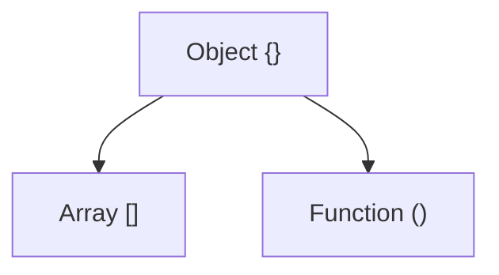

# The Javascript Engine
- JIT compilation
	- Code is first interpreted
	- *Profiler* watches code and figures out ways it can be optimized
	- If some lines of code are run more than once it passes that code onto the *compiler*
	- Replaced bytecode with machine code
	- *Knowing all this helps us write more optimized code, and avoid confusing the compiler*

## Optimization
- Things to avoid
	- `eval()`
	- arguments (use destructuring instead)
	- for in (use `Object.keys()` instead)
	- with
	- delete
- Inline caching
	- Code that executes the same function repeatedly uses this
	- Instead of looking up parameters and running the method again it just replaces the method with the value the method returns
- Hidden Classes
	- `delete` really effects this
	- To avoid deoptimization, assign all properties in a constructor and setting variables in the same order

## WebAssembly
- Standard binary executable for browsers

## Memory Leaks
- Common causes
	- Too many global variables or overly large global variables
	- Adding event listeners but never removing them
	- `setInterval()` - referencing objects in here but NEVER clear the interval will stop those referenced objects from ever being cleaned up

## Single Threaded
- Has only one callstack
- No running functions in parallel
- JS is synchronous

# Javascript Runtime
- Web API comes with the browser in its Javascript Runtime
	- `fetch`
	- `setInterval()`
	- Implemented by C++ or something similar in the Browser
	- *Asynchronous*
- Call Stack will call out to Web API for things like `setTimeout()` and the Web API will handle it in a separate thread/background
- Response from Web API will add an event to the Event Loop which notifies the Call Stack *once it's free* that there's something in the Callback Queue, and *when it's available will add it to the Call Stack*

```
Call Stack -> Web API -> Event Loop + Callback Queue -> Call Stack
```

## Cool Example
```javascript
console.log(1)
setTimeout(() => console.log(2), 0)
console.log(3)

// will output:
// 1
// 3
// 2

// This execution will happen in this order NO MATTER WHAT time we set in setInterval() because setInterval() is part of the Web API and will only ever be ran AFTER the Call Stack is empty, which won't occur until the Javascript file is completely ran and done!
```

# NodeJs
- Javascript *runtime*
![[Pasted image 20230808094638.png]]
- Doesn't have `window` but does have `global`, which includes stuff like
	- `setInterval()`
- Offers a new type of server model for handling requests
![[Pasted image 20230808094958.png|400]]
	- PHP
		- Used to create a thread for each request
		- Thread pool (however many reqs the server can accept) can max out
	- NodeJS
		- Any req comes in and gets tossed onto it's async runtime
		- Can handle as many requests as you want

# Terms and Special Methods
## Terms
`Execution Context` - when the code sees a set of brackets it'll create an execution context, and adds it to the stack.  You have things like `this` and all variables, methods, etc, available in a specific context.

`Lexical Environment` - where something is written/defined.  Can be accessed via `[[scope]]`

`Lexical Scope / Static Scope` - available data + vars where func was defined determines our available vars.  Not where the function is called (`Dynamic Scope`)

`Hoisting` -  JS engine allocating memory for variables and funcs in creation phase before it executes it (lets you run the `sing()` method before it's actually been defined in the file, like right before the function is defined).  Variables are undefined initially (partially hoisted), but functions actually get defined (fully hoisted).  The first thing the engine has to see is `var` or `function` it'll hoist(NO OTHER TERMS), but if you wrap methods in parenthesis or use something like `const` it won't get hoisted.  *This occurs every time we create a function too!*  **Avoid hoisting if we can, by not using `var`, and instead use `const` and `let`.**

`Function Expression` - `const thing = function() {}` - defined at runtime

`Function Declaration` - `function blah() {}` - defined at parse time

`arguments` - reserved variable present in all function execution contexts, and is an index based object that points to each of the arguments passed in. (ex: `marry('bob', 'sally')` would have the following `arguments` value `{0: 'bob', 1: 'sally'}`).  This is dangerous to use, was initially used, but really shouldn't be used anymore (according to the author).  Meh, this seems fine to use if it's useful and you're careful.

`Variable Environment` - where variables live in the execution context

`Scope Chain` links us to variables and things inside the parent environment

`'use strict'` was added to stop JS from trying to do weird tricks/pitfalls

`function scope` - scope inside something between brackets, like inside an `if` statement.  If you use `var` the variable defined there will be available outside of the block.  Other languages use `block scope` that wouldn't allow this variable to be accessed globally.  If you use the `let` or `const` keyword tho it'll cause `block scope` to be used.

`this` - can unexpectedly refer to the `Window` object in the browser, even inside a function, which can be odd.  This can go away with the `use strict` flag.  `this` == "who called me"?  Isn't lexically scoped, is actually dynamically scoped: *it only matters who called it*

`use strict` - Disables funky weird JS behavior.  ES6 modules use this by default.

`arrow functions` - lexically scoped

`scope` is a function based thing, `context` is more about objects (ex: what's the value of the `this` var?).  `context` relates to how and who calls a function, while `scope` relates to the visibility of the variables.

## call()
`a()` is the same as `a.call()`, all functions have `call()` implicitly added... However, `call()` calls a method of an object, substituting another object for the current object.

## apply()
Same as `call()`,  except that `apply()` takes an array of parameters rather than individual parameters

```
// call()
obj.stuff.call(anotherObj, 1, 2, 3, 4)

// apply()
obj.stuff.call(anotherObj, [1, 2, 3, 4])
```

## bind()
Returns a new function with a certain context and parameters.  Usually used when we want a certain function to be called later on with a specific context.  Lets us specify the context and parameters to pass to the function ahead of time, and we can call the function later.  Nifty!

### bind() and currying
`bind()` lets you bind to a method without specifying all parameters, thus we can easily curry a method!

# Types
- Primitive - *single values in memory*, *have object wrappers* (primitives act as you'd expect, but have functions attached to them like an object), and *immutable*
	- Numbers
	- Boolean
	- String
	- Undefined
		- Absence of definition
	- Null (type == object - is a mistake the creator admitted)
		- There's no value there.  Absence of value.
	- Symbol('just me') (ES6)
		- Used for obj properties to ensure the property is unique
		- Won't use much
- Non-Primitive - *doesn't contain actual value directly*
	- Objects {} (which is also an array and function)

`typeof` - tells us the type of a variable


*Arrays and functions are objects*

`typeof function == 'function'`, but underneath the hood it's an object

## Arrays
These two are effectively equivalent
```
[1,2,3]

{
	0: 1,
	1: 2,
	2: 3
}
```

`Array.isArray()` tells us if an array/object is an array

## Deep Clone
`JSON.parse(JSON.stringify(obj))` - deep clone that works, but can be CPU intensive, should probably clone a different way

## Type Coercion
The language converting a type to another type

JS has a heavy hand in this because it's dynamically typed, and JS tries to help you (sometimes to a fault)

`==` - compare with type coercion (don't use this, it's confusing)
`===` - compare without coercion

# The Two Pillars (Closures and Protypal Inheritance)
## Functions are objects
JS under the hood creates a "callable object"

```js
function blah() {
	console.log('hey')
}

// is effectively the same as the following (tho this code won't work)

// 'callable object' that gives it some bonus props and methods, plus can be called via ()
blah = {
	name: 'blah', // doesn't exist for anon functions
	(): console.log('hey'),
	call(),
	apply(),
	bind()
}
```

`new Function()` - function constructor, where you pass the function text into the constructor, and you can tell it the parameter names as well

`First Class Citizens`
1. Functions can be assigned to vars and properties of objects
2. Pass functions as arguments to another function
3. Can return functions as a value from other functions

`Higher Order Functions` - Function that can take an argument as an arg, or returns a function

### Things to watch out for
- Init functions in loops
- Good to set default params on a function to avoid edge cases

